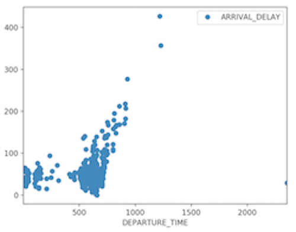
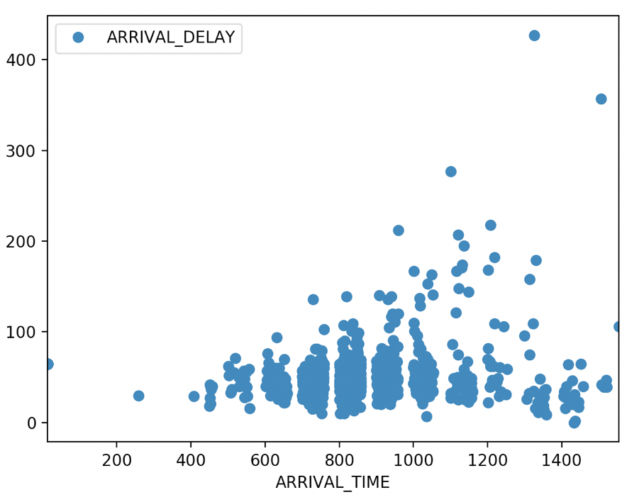
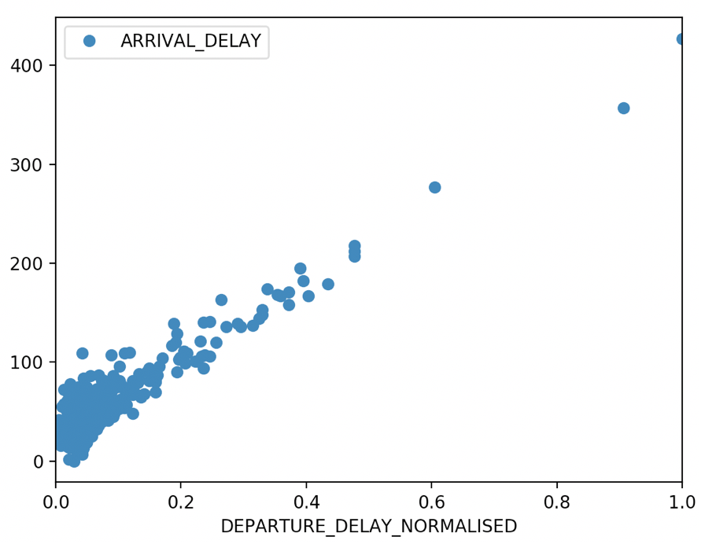

# Flight Optimizer
Flight Optimizer helps Airlines process raw Flights data and infer meaningful patterns that can be leveraged to reduce Flight Delays and enhance Customer Experience.

## Factors Responsible for Flight Delays
There are numerous factors which can lead to Flight Delays, some of the most prominent are:

Session Split:
* Departure Time
* Arrival Time
* Departure Delay
* Diverted
* Cancelled
* Air System Delay
* Security Delay
* Airline Delay
* Late Aircraft Delay
* Weather Delay

# Impact of Departure Time
The Departure Time impacts the Arrival Delay pretty Significantly.
Flights departing during early morning are comparatively less delayed than the ones departing during regular morning hours

# Impact of Arrival Time
The Arrival Time impacts the Arrival Delay pretty Significantly.
Flights arriving around day time (1400 hrs) are a bit more delayed than the ones arriving at mid night to early morning

# Impact of Departure Delay
The Departure Delay impacts the Arrival Delay pretty Significantly.
The Arrival Delay increases as the Departure Delay increases

## Folder structure
* The source code goes in the `<src>` folder, the data is in the `<data>` folder, the tests go in the `<test>` folder
* within `<src>` we will have a separate package (folder) for each problem we will tackle. E.g. data manipulation is in `<datamanipulation>`

For the hacking session, please implement the following tasks:
1. Create a virtual environment with the Python interpreter
2. Complete all of the tasks in the files `src/datamanipulation/airline_manipulation` and `src/datamanipulation/data_preprocessing`
3. In `tests/test_data_manipulation.py`, write unit tests to the code in data_preprocessing 
4. Debug through a function
5. Initialise a logger and insert logging into the code
6. Ensure you have appropriate error handling for your code
7. Do some plotting by writing appropriate code in `src/plotting/data_visualisation`

[Optional] - for those who finish all the points above:
7. Write a function decorator that logs how long a function took to run

## Usage
* Install the required Packages
* Navigate to the src directory and run the following command:

python -m datamanipulation.airline_manipulation

